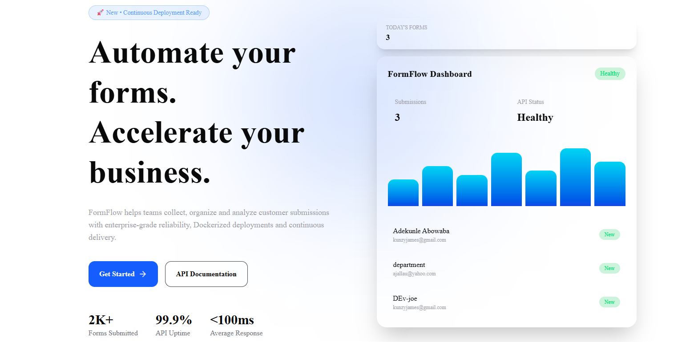
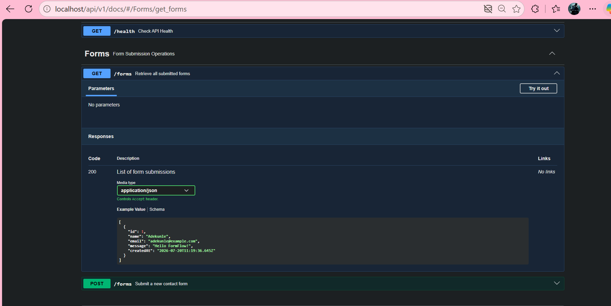
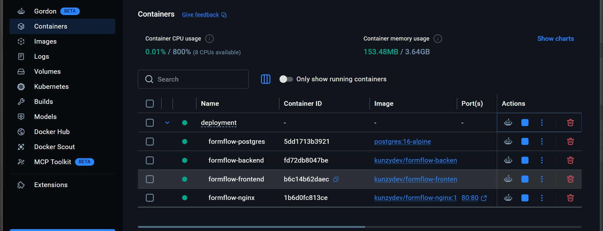
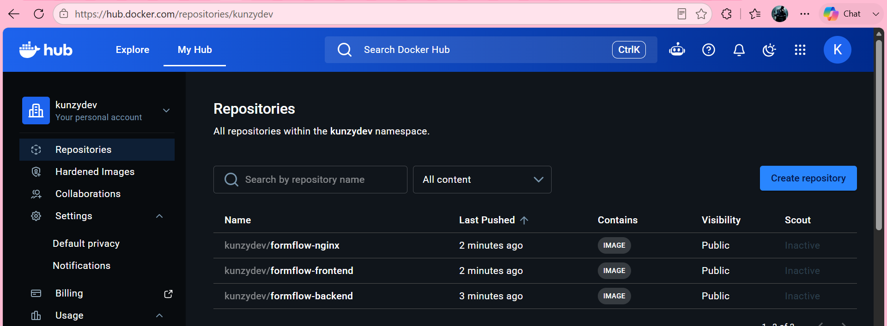
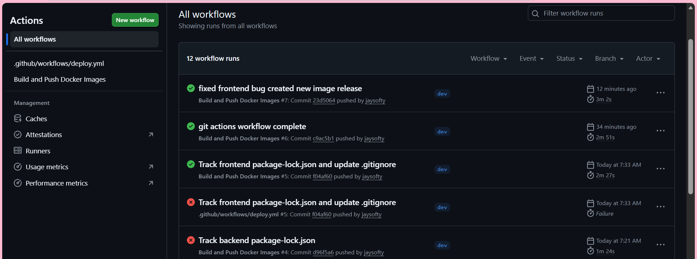
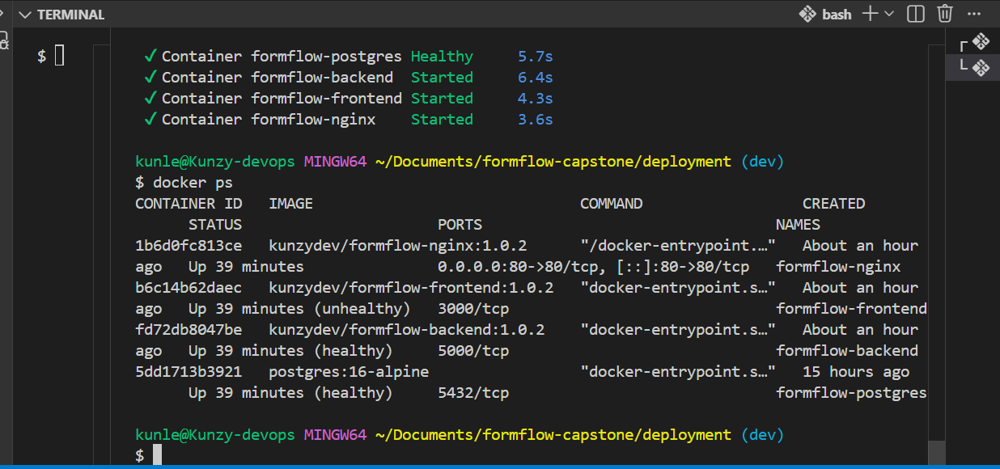

# formflow-capstone
### Dockerized 3-Tier SaaS Application with Automated CI/CD

> A production-ready SaaS platform built with modern DevOps practices — featuring containerized architecture, automated deployments, versioned releases, and rollback capability.

---

## 📌 Overview

**FormFlow** is a fully containerized 3-tier web application designed to simulate real-world SaaS deployment environments.

It enables teams to:

* Ship features continuously
* Track exactly what version is running in production
* Roll back instantly when deployments fail
* Deploy with confidence using CI/CD automation

---

## 🧱 Architecture

```
                           Internet
                               │
                         Port 80 / 443
                               │
                    Nginx Reverse Proxy
                               │
          ┌────────────────────┼───────────────────┐
          │                    │
          ▼                    ▼
     React Frontend      Express REST API
                               │
                          Prisma ORM
                               │
                          PostgreSQL
                        Docker Volume

────────────────────────────────────────────────

Infrastructure (Terraform)

Azure Resource Group
        │
Virtual Network
        │
Application Subnet
        │
Network Security Group
        │
Public IP
        │
Azure Bastion
        │
Ubuntu VM (Deployment Target)

```

### 🔹 Frontend

* React (Vite)
* Nginx (static serving + reverse proxy)

### 🔹 Backend

* Node.js + Express
* REST API
* Business logic + validation

### 🔹 Database

* PostgreSQL
* Persistent storage (Docker volume)

---

## ⚙️ Tech Stack

| Layer         | Technology           |
| ------------- | -------------------- |
| Frontend      | React (Vite) + Nginx |
| Backend       | Node.js + Express    |
| ORM           | Prisma               |
| Database      | PostgreSQL           |
| Containers    | Docker               |
| Orchestration | Docker Compose       |
| Reverse Proxy | Nginx - App-Entry    |
| CI/CD         | GitHub Actions       |
| Registry      | Docker Hub           |
| Cloud Platform| Microsoft Azure      |


---

## 📁 Project Structure

```
formflow-capstone/
│
├── frontend/
├── backend/
├── database/
├── deployment/
├── docs/
├── .github/workflows/
├── README.md
└── LICENSE
```

---


## 🚀 Project Status

The project has successfully completed the core implementation phase and demonstrates a modern DevOps workflow.

### Completed

- ✅ React frontend
- ✅ Express + TypeScript REST API
- ✅ PostgreSQL database
- ✅ Prisma ORM integration
- ✅ Swagger/OpenAPI documentation
- ✅ Dockerized frontend, backend and database
- ✅ Multi-stage Docker builds
- ✅ Docker Compose (Development)
- ✅ Docker Compose (Production)
- ✅ Docker Hub image registry
- ✅ GitHub Actions CI pipeline
- ✅ Semantic versioning
- ✅ Automatic Prisma migrations
- ✅ Health check endpoint
- ✅ Terraform infrastructure modules

### In Progress

- ⏳ Automated deployment to Azure VM (pending Azure VM provisioning)


## 🐳 Docker Strategy

### Frontend

* Multi-stage build (Node → Nginx)
* Optimized production image

### Backend

* Lightweight Node Alpine image
* Production dependencies only

### Database

* Official PostgreSQL image
* Persistent volume storage

---


## 📦 Release Management

Production images are versioned using Semantic Versioning (SemVer).

Example:

```
kunzydev/formflow-backend:1.0.2
kunzydev/formflow-frontend:1.0.2
kunzydev/formflow-nginx:1.0.2
```

Every release is immutable and published to Docker Hub.

Production deployments reference a single `IMAGE_TAG` variable stored inside `.env.production`, making deployments deterministic and simplifying rollback.

## 🔢 Versioning Strategy

We use **Semantic Versioning (SemVer)**:

```
v1.0.0
v1.0.1
v1.1.0
```

Each release includes:

* Docker image tag
* Git commit SHA
* Full traceability

### Example:

```
formflow-backend:v1.0.2
commit: 2fb83ea
```

---

## 🔁 Rollback Strategy

If a release introduces issues:

1. Update `IMAGE_TAG` inside `.env.production`
2. Pull the previous Docker images

```bash

docker compose \
  --env-file .env.production \
  -f docker-compose.prod.yml \
  pull

```

3. Restart the application

```bash

docker compose \
  --env-file .env.production \
  -f docker-compose.prod.yml \
  up -d

```

4. Verify the running version

```bash

docker inspect formflow-backend --format='{{.Config.Image}}'
```

Rollback requires no image rebuilding because all released versions remain available in Docker Hub.

## 🚀 Production Deployment

Production uses immutable Docker images stored in Docker Hub.

Deploy the latest release:

```bash
docker compose \
  --env-file .env.production \
  -f docker-compose.prod.yml \
  pull

docker compose \
  --env-file .env.production \
  -f docker-compose.prod.yml \
  up -d
```

Verify the deployed version:

```bash
docker inspect formflow-backend --format='{{.Config.Image}}'
```
---

## ☁️ Infrastructure

Infrastructure is provisioned using Terraform.

Current modules include:

- Azure Resource Group
- Virtual Network
- Application Subnet
- Azure Bastion Subnet
- Network Security Group
- Public IP
- Network Interface
- Azure Bastion

The deployment target is an Ubuntu Linux VM. Automated deployment will be enabled once Azure VM provisioning is completed.

## 🔐 Secrets Management

| Secret             | Storage Location           |
| ------------------ | -------------------------- |
| DB Password        | VM `.env` + GitHub Secrets |
| Docker Credentials | GitHub Secrets             |
| SSH Private Key    | GitHub Secrets             |
| API Keys           | VM `.env`                  |

🚫 No secrets are hardcoded or committed.

---

## ⚡ CI/CD Pipeline

### Workflow

```
Developer

      │

Push to dev

      │

GitHub Actions

      │

Checkout Repository

      │

Build Backend

      │

Build Frontend

      │

Build Nginx

      │

Push Versioned Images

      │

Docker Hub

      │

(Deployment Stage)

      │

SSH Azure VM

      │

docker compose pull

      │

docker compose up -d

```

---

## ☁️ Deployment

### Production Environment

* Ubuntu Linux VM
* Docker + Docker Compose installed
* Only **Port 80 exposed**

### Access

```
http://<your-public-ip>
```

---

## 🧪 Health Check

```bash
curl http://<server-ip>/api/health
```

Response:

```json
{
  "status": "OK"
}
```

---

## 📸 Screenshots (To Include)

* GitHub repository
* Docker Hub images & tags
* CI/CD pipeline success
* Running containers (`docker ps`)
* Live application
* API response
* Rollback process

---

## 🚨 Incident Report (Example)

**Symptom:**
API returned `500 Internal Server Error`

**Investigation:**

* Checked container logs
* Verified DB connectivity
* Confirmed environment variables

**Root Cause:**
Incorrect database hostname

**Fix:**
Updated `.env` and redeployed previous stable version

**Reflection:**
Versioned deployments and container isolation reduced downtime and simplified recovery.

---

## ✨ Features

- Dockerized 3-tier SaaS architecture
- React frontend with Express REST API
- PostgreSQL with Prisma ORM
- Multi-stage Docker builds
- Docker Compose (Development & Production)
- Swagger/OpenAPI documentation
- Automatic Prisma database migrations
- GitHub Actions CI pipeline
- Docker Hub image registry
- Semantic versioning and rollback support
- Terraform Infrastructure as Code
- Azure-ready deployment architecture

---

## 🧠 Design Decisions

* Separate containers for scalability and maintainability
* Immutable Docker images for traceability
* CI/CD automation to eliminate manual deployment errors
* Reverse proxy (Nginx) to expose only port 80

---

## 🚀 Getting Started (Local)

```bash

git clone https://github.com/<your-username>/formflow-capstone.git

cd deployment

docker compose up --build -d

```

---

## 📦 Docker Images

Production images are published to Docker Hub.

- `kunzydev/formflow-backend`
- `kunzydev/formflow-frontend`
- `kunzydev/formflow-nginx`

---

## 📸 Screenshots

### Landing Page



---

### Swagger API Documentation



---

### Docker Desktop



---

### Docker Hub Images



---

### GitHub Actions Pipeline



---

### Running Containers



---


## 👨‍💻 Author

**Group 1**
Adekunle James 

---

## 📜 License

MIT License

---

## ⭐ Final Note

FormFlow demonstrates modern cloud-native application delivery by combining Docker, Docker Compose, Prisma ORM, GitHub Actions, Docker Hub, Terraform, and Azure deployment practices into a production-ready DevOps workflow.

For a detailed explanation of the implementation, architecture, CI/CD pipeline, and deployment process, refer to the accompanying Design Report and Student Report included with this project.

---

> 💡 *“If you can deploy it, version it, and roll it back — you can scale it.”*
